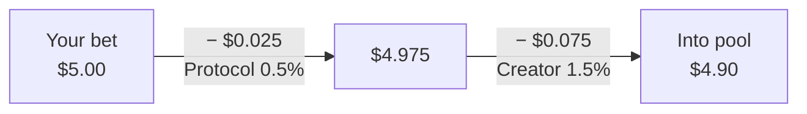

Every bet has two fees deducted up front. Whatever's left enters the pool and earns you a payout if you win.

## Fee breakdown



| Fee | Typical | Max | Goes to |
|---|---|---|---|
| Protocol fee | `0.5%` | `1%` | Protocol treasury |
| Market-creator fee | `1.5%` | `5%` | Market creator |

Total typical cost: **`2%`** per bet. For comparison, traditional sportsbooks charge `5–10%`.

<Tip>
  The app shows you the exact fees before you confirm. Always check there - rates can be updated by the protocol.
</Tip>

## How odds work

Each side has a pool - the running total of USDC bet on that option. Your potential payout comes from the ratio of the total pool to the side you bet on:

```
entryOdds = totalPool / yourSidePool
```

**Example:** `$3,000` on YES, `$1,000` on NO - total pool `$4,000`.

- Bet YES → `4000 / 3000 = 1.33×` your net stake if YES wins.
- Bet NO → `4000 / 1000 = 4×` your net stake if NO wins.

Your `entryOdds` are **locked in** the moment your bet lands. Bets that come in after yours don't change your payout.

## Settlement payout

When the market closes, Arcium decrypts every position and the protocol computes a final **payout ratio** to ensure total payouts don't exceed the vault. In normal markets this is close to `1`. In edge cases (imbalanced pools, high fees), it can be slightly lower.

The app shows your projected payout in the Positions tab. When you claim, the protocol pays out automatically.

## Creator bond

Opening a market requires a **USDC bond** of at least `$20`. The bond is held until resolution and returned - with accumulated creator fees - when the market closes cleanly.

The bond prevents market spam and gives the creator a reason to resolve correctly. It's collateral, not a fee.

## What's next

- [Market lifecycle](/how-it-works/lifecycle) - when fees apply and when you can claim.
- [Place a bet](/guides/place-a-bet) - how to bet and read the fee preview.
- [Create a market](/guides/create-a-market) - the bond you'll need to post.
