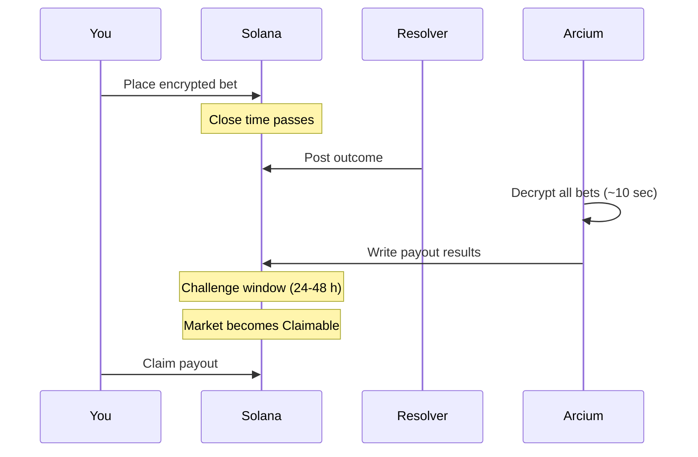

Every market follows the same path: open for bets → resolver posts outcome → challenge window → claim. This page shows what each phase means and what you can do in each one.

## Phases at a glance

| Phase | What it means | Your action |
|---|---|---|
| **Betting** | Market is open. | Place a bet |
| **Awaiting resolve** | Betting closed. Waiting for the resolver. | Wait |
| **Pending resolution** | Outcome posted. Challenge window open (24-48 h). | Flag if wrong |
| **Disputed** | Someone flagged the result. Admin reviewing. | Wait |
| **Claimable** | Challenge window passed. Payouts available. | Claim if you won |
| **Refundable** | Resolver never posted. Stakes returnable. | Claim refund |
| **Expired** | All deadlines passed. | Nothing |

## The happy path

For most markets:

1. Betting opens when the market is created.
2. The close time passes - no new bets.
3. The resolver posts the outcome. Arcium decrypts every bet and computes payouts (≈10 seconds).
4. A 24-48 hour challenge window opens. No flags → market enters **Claimable**.
5. Winners claim USDC.

## Edge cases

**Resolver doesn't show up.** After the resolution deadline, the market enters **Refundable**. Bettors pull back their net stake.

**Someone flags the result.** The market enters **Disputed**. An admin reviews and posts the correct outcome. Market becomes **Claimable** after the override.

**Multiple bets on the same market.** Each bet is a separate position. You claim them one at a time.

## What's next

- [Place a bet](/guides/place-a-bet) - the **Betting** phase from your side.
- [Claim payout](/guides/claim-payout) - the **Claimable** phase.
- [Dispute resolution](/guides/dispute-resolution) - how to flag a bad result.
