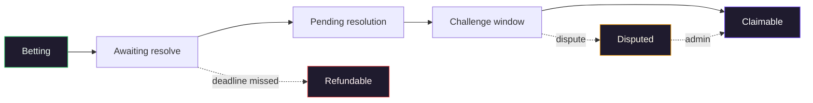

Every market on Cyphers follows a predictable timeline: it opens for bets, it closes, it gets resolved, and winners can claim. This page walks through each phase and what you can do at every step.

If you just want to know what your wallet can do *right now* on a given market, look at the market's status badge in the app. The phase tells you which actions are available.

## The phases at a glance

The phases in order:

| Phase | What it means | What you can do |
|---|---|---|
| **Betting** | The market is open. The close time hasn't been hit yet. | Place a bet |
| **Awaiting resolve** | Betting has closed. Now the resolver needs to post the outcome. | Wait |
| **Pending resolution** | The resolver posted the outcome and Arcium has computed the result. The challenge window is open. | Flag the resolution if it looks wrong |
| **Disputed** | Someone flagged the result. An admin investigates and posts the correct outcome. | Wait |
| **Claimable** | The market is resolved and the challenge window has passed. | Claim if you won |
| **Refundable** | The resolver never showed up. You can pull your stake back. | Claim a refund |
| **Cancelled** | The creator cancelled before any bets were placed. | Nothing - this rarely affects users |
| **Expired** | All deadlines passed. Unclaimed funds go to protocol housekeeping. | Nothing |

## The happy path

For most markets, the journey is short:

1. **Betting** opens when the market is created.
2. **Awaiting resolve** kicks in when the close time hits - usually a few days or weeks later.
3. The resolver posts the real outcome. Arcium decrypts every bet and computes payouts (about `10` seconds).
4. **Pending resolution** opens a 24–48 hour challenge window. If nobody flags it, the market enters **claimable**.
5. Winners claim their USDC. Done.

Most markets follow this path with no drama.

## What can go wrong, and what happens

**The resolver doesn't show up.** Every market has a resolution deadline. If the resolver misses it, the market enters **refundable** and bettors can pull their net stake back via Claim Refund.

**Someone flags the resolution.** During the 24–48 hour challenge window, anyone can flag the posted outcome. The market enters **disputed**. An admin reviews the situation and posts the correct outcome via an admin override. After that, the market is **claimable** again.

**A user has multiple bets on the same market.** That's fine. Each bet is a separate position. You claim each one separately.

## How long each phase lasts

Roughly:

- **Betting**: as long as the creator set, usually days or weeks.
- **Awaiting resolve**: until the resolver acts - could be minutes, could be hours.
- **Pending resolution / challenge window**: 24 to 48 hours (creator chooses at market creation).
- **Claimable**: until the claim deadline - typically a few days after the challenge window closes.

If you bet, plan to check back after the market closes. The app will show the right action for the current phase.

## What's next

- [Place a bet](/guides/place-a-bet) - the **Betting** phase from the bettor's perspective.
- [Claim payout](/guides/claim-payout) - the **Claimable** phase.
- [Dispute resolution](/guides/dispute-resolution) - what to do during the challenge window.
