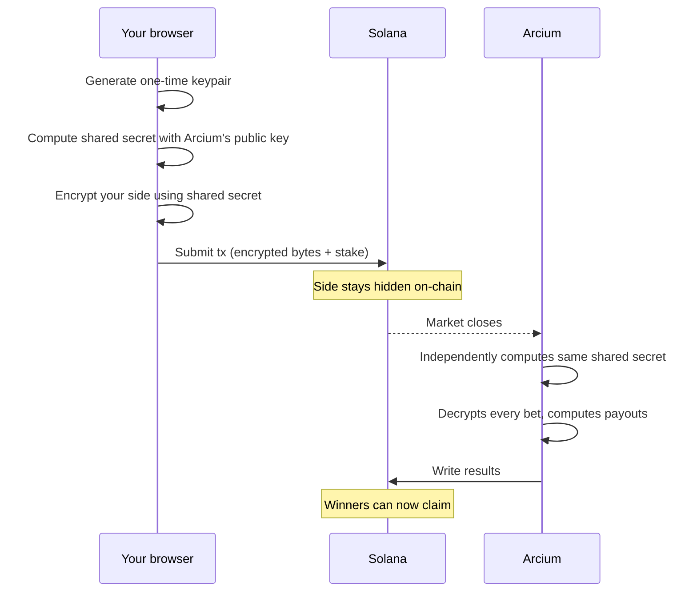

Cyphers hides which side you bet on — YES, NO, or which option — until the market settles. Your wallet address and stake are still public. Here's how it works.

## What's hidden, what's not

| On your position | Visible to others? |
|---|---|
| Wallet address | Yes |
| Stake amount | Yes |
| Locked-in odds | Yes |
| **Your chosen side** | **No — encrypted** |
| Settlement result | Yes, once resolved |

## How the encryption works

When you click **Bet**, your browser runs a short key-exchange before anything touches Solana:

The shared secret — the number both sides derive independently using Diffie-Hellman — never appears on chain. Anyone reading the chain sees encrypted bytes they can't reverse.

## The key in your browser

After a successful bet, the app saves your private key to browser local storage, keyed by market + bet index. It uses this key for one thing: **showing you your own side** in the Positions tab.

<Warning>
  Clearing browser data or switching to a different device removes this key. Your side shows as "encrypted" in the UI — but your bet and payout are completely safe. The protocol already knows the result from the Arcium decryption at settlement. You don't need the key to claim.
</Warning>

## What Cyphers doesn't protect

- **Your wallet is public.** Anyone can list your on-chain positions.
- **Your stake is public.** The amount is in plain text on chain.
- **That you bet on a market is public.** Cyphers hides what you bet, not that you bet.
- **Timing is public.** Block timestamps show roughly when each bet was placed.

If you need to hide your participation entirely, you'd need a separate wallet — that's outside what Cyphers does.

## What's next

- [Market lifecycle](/how-it-works/lifecycle) — what happens after the market closes.
- [FAQ](/troubleshooting/faq) — common questions about privacy and key recovery.
