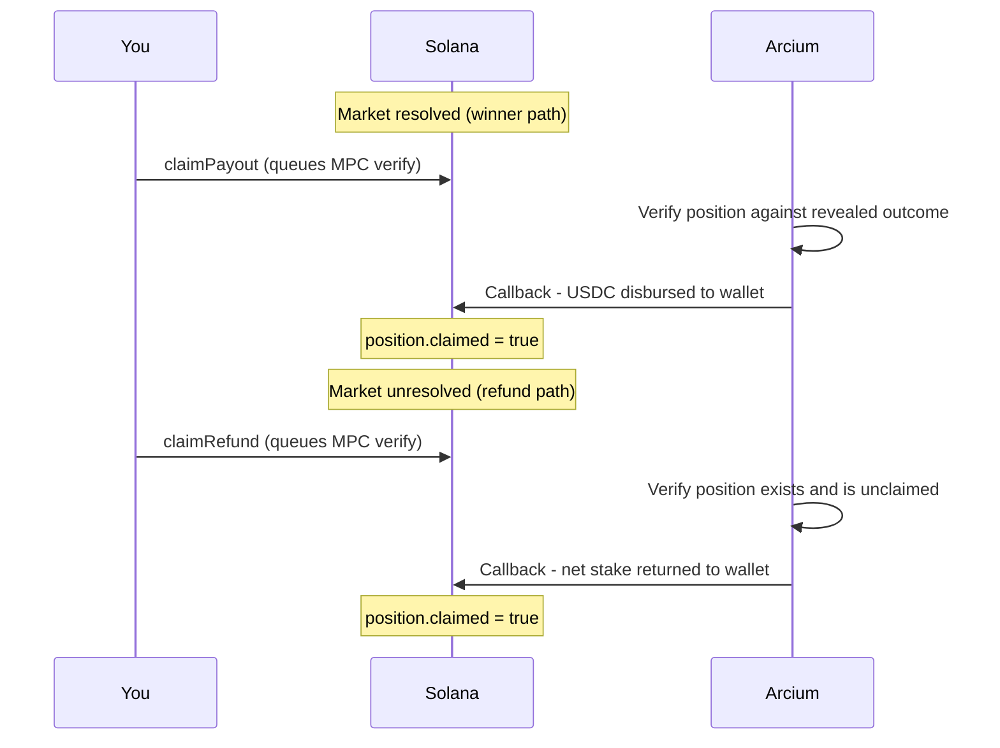

Once a market is resolved or expired, winners and refund-eligible bettors each trigger an Arcium MPC computation to verify their encrypted position and compute the transfer amount - no local private key required.



---

## claimPayout

Claims the winner's USDC payout from a resolved market. The Arcium MPC circuit verifies the encrypted position against the revealed outcome and computes the transfer amount.

```typescript TypeScript
const result = await client.actions.claimPayout({
  payer: walletPublicKey,
  user: walletPublicKey,
  marketId: 42n,
  betIndex: 0n, // which bet to claim - defaults to 0n
  onProgress: ({ stage }) => setStatus(stage),
});

console.log("Claimed:", result.signature);
```

<Note>
  You do not need the local private key to claim. The Arcium reveal circuit
  already decrypted the bet pools when the market resolved - the payout ratio is
  now public on-chain. The claim circuit uses your position's `netAmount` field
  (plaintext) to compute your share.
</Note>

### Parameters

<ParamField body="payer" type="PublicKey" required>
  Transaction fee payer.
</ParamField>

<ParamField body="user" type="PublicKey" required>
  The bettor's public key. Must match the position's `user` field.
</ParamField>

<ParamField body="marketId" type="bigint | number" required>
  A resolved market in `claimable` phase.
</ParamField>

<ParamField body="betIndex" type="bigint | number">
  Which position to claim. Defaults to `0n`. Users who placed multiple bets on
  the same market must pass the specific index. Check
  `EncryptedPositionAccount.betIndex` on each position to find which ones to
  claim.
</ParamField>

<ParamField body="computationOffset" type="bigint">
  Arcium computation slot. Random by default.
</ParamField>

<ParamField body="timeoutMs" type="number">
  Milliseconds to wait for the MPC callback. Defaults to `60_000`.
</ParamField>

<ParamField body="onProgress" type="ProgressCallback">
  Progress stages: `validating → fetching-state → submitting → awaiting-callback
  → refetching → done`.
</ParamField>

### Return value

<ResponseField name="signature" type="string">
  Transaction signature.
</ResponseField>

<ResponseField name="position" type="EncryptedPositionAccount | null">
  Updated position with `claimed: true`.
</ResponseField>

<ResponseField name="market" type="MarketAccount | null">
  Updated market account.
</ResponseField>

<ResponseField name="computation" type="ComputationResult">
  Arcium callback result.
</ResponseField>

---

## claimRefund

Claims a full refund when the market's resolver never posted an outcome and the resolution deadline has passed.

```typescript TypeScript
const result = await client.actions.claimRefund({
  payer: walletPublicKey,
  user: walletPublicKey,
  marketId: 42n,
  betIndex: 0n,
});
```

Takes the same parameters as `claimPayout`. The market must be in `refundable` phase - past the resolution deadline with no outcome posted (`state === Unresolved`).

<Note>
  Refunds are available when the resolver fails to post within
  `DEFAULT_RESOLUTION_WINDOW_SECS` (7 days after close time). The refunded
  amount is the user's original net stake.
</Note>

---

## Claiming multiple bets

If a user placed multiple bets on the same market, each position must be claimed separately.

```typescript TypeScript
const positions = await client.positions.byUser(walletPublicKey);
const forMarket = positions.filter(
  (p) => p.account.market.equals(marketPda) && !p.account.claimed,
);

for (const { account } of forMarket) {
  await client.actions.claimPayout({
    payer: walletPublicKey,
    user: walletPublicKey,
    marketId,
    betIndex: account.betIndex,
  });
}
```

---

## Phase requirements

| Action        | Market phase | Market state   |
| ------------- | ------------ | -------------- |
| `claimPayout` | `claimable`  | Resolved (2)   |
| `claimRefund` | `refundable` | Unresolved (3) |

Call `marketPhase(market)` from `@cypher-zk/sdk` to check the current phase before showing claim buttons.
