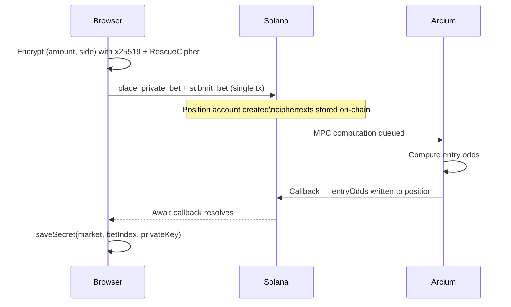

`placeBet` is the core SDK action. It encrypts the user's stake and chosen outcome using Arcium's x25519 + RescueCipher scheme, bundles the deposit and MPC queue instructions into a single transaction, waits for the Arcium callback to finalize entry odds, then returns the result.



```typescript TypeScript
const result = await client.actions.placeBet({
  payer: keypair.publicKey,
  user: keypair.publicKey,
  marketId: 42n,
  side: 1,              // 1 = YES for a YesNo market
  amountUsdc: 5_000_000n, // $5.00 USDC (6 decimals)
  onProgress: ({ stage, message }) => console.log(`[${stage}] ${message}`),
});

// Persist the private key immediately
saveSecret(result.position!.market, result.betIndex, result.userKeypair.privateKey);
```

<Warning>
  Call `saveSecret` (or store `result.userKeypair.privateKey`) before the page unloads. If the process exits without saving it, you lose the ability to display your side in the UI. Your funds are still safe - you can still claim.
</Warning>

---

## Parameters

<ParamField body="payer" type="PublicKey" required>
  Transaction fee payer and rent payer. Usually the connected wallet public key.
</ParamField>

<ParamField body="user" type="PublicKey" required>
  The bettor whose position PDA is created. The position is keyed on `user`, not `payer` - in relay flows these can differ. Usually `user === payer`.
</ParamField>

<ParamField body="marketId" type="bigint | number" required>
  Numeric market ID (the `marketId` field on `MarketAccount`).
</ParamField>

<ParamField body="side" type="number" required>
  Outcome index to bet on.

  | Value | YesNo markets | MultiOutcome markets |
  |---|---|---|
  | `0` | NO | Option 0 (first label) |
  | `1` | YES | Option 1 |
  | `2` | - | Option 2 |
  | `3` | - | Option 3 |
</ParamField>

<ParamField body="amountUsdc" type="bigint | number" required>
  Gross bet in micro-USDC (6 decimal places). `1_000_000n` = $1.00. The SDK deducts protocol and LP fees and encrypts the net amount.
</ParamField>

<ParamField body="userKeypair" type="UserCryptoKeypair">
  Pre-generated x25519 keypair. If omitted, the SDK generates one via `createUserKeypair()`. Pass one only if you created and stored it before calling `placeBet` (e.g., for a pre-flight UX that shows the keypair to the user first).
</ParamField>

<ParamField body="computationOffset" type="bigint">
  Arcium computation slot offset. Random by default. Override for testing or retry correlation.
</ParamField>

<ParamField body="timeoutMs" type="number">
  Milliseconds to wait for the Arcium callback. Defaults to the SDK global (`60_000`). Set higher for slow network conditions.
</ParamField>

<ParamField body="onProgress" type="ProgressCallback">
  Called at each stage of the flow. Useful for driving a live status UI.

  ```typescript
  onProgress: ({ stage, message, signature, computationOffset }) => {
    setStatus(`${stage}: ${message}`);
  }
  ```

  See the [progress stages](#progress-stages) table below.
</ParamField>

---

## Return value

<ResponseField name="signature" type="string">
  Base58 transaction signature of the bet + queue transaction.
</ResponseField>

<ResponseField name="userKeypair" type="UserCryptoKeypair">
  The x25519 keypair used to encrypt the bet. `privateKey` is a `Uint8Array` - persist it immediately.

  ```typescript
  interface UserCryptoKeypair {
    privateKey: Uint8Array; // 32 bytes — persist this
    publicKey: Uint8Array;  // 32 bytes — stored on-chain
  }
  ```
</ResponseField>

<ResponseField name="betIndex" type="bigint">
  The position index assigned to this bet. Users who place multiple bets on the same market get incrementing indices (`0n`, `1n`, `2n`, ...). Pass this to `saveSecret`, `claimPayout`, and `claimRefund`.
</ResponseField>

<ResponseField name="position" type="EncryptedPositionAccount | null">
  The position account refetched after the callback ran. `null` on very rare RPC slowness - the funds are always safe.
</ResponseField>

<ResponseField name="computation" type="ComputationResult">
  Raw Arcium computation result. Contains `computationOffset` and callback slot info. Useful for debugging.
</ResponseField>

<ResponseField name="computationOffset" type="bigint">
  The Arcium computation slot offset used for this bet.
</ResponseField>

---

## Progress stages

The `onProgress` callback fires at each of these stages:

| Stage | What's happening |
|---|---|
| `validating` | Market exists and is Active; amount exceeds `min_bet` |
| `fetching-state` | Fetching GlobalState for fee rates and accepted mint |
| `encrypting` | Generating x25519 keypair; encrypting `(netAmount, side)` with RescueCipher |
| `submitting` | Sending the deposit + MPC queue transaction |
| `awaiting-callback` | Waiting for Arcium MPC nodes to finalize entry odds (~5-15 sec) |
| `refetching` | Fetching the updated position account |
| `done` | Bet placed; result returned |

---

## Persisting the private key

The bet position is fully encrypted on-chain. The only way to display the bet side or stake in your UI later is to re-derive the RescueCipher using the original private key. Store it using the same key format the website uses:

```typescript TypeScript
// src/lib/persist-secret.ts
const key = `cypher:pos:${market.toBase58()}:${betIndex}`;

export function saveSecret(market: PublicKey, betIndex: bigint, secret: Uint8Array) {
  const hex = Array.from(secret, (b) => b.toString(16).padStart(2, "0")).join("");
  localStorage.setItem(key, hex);
}

export function loadSecret(market: PublicKey, betIndex: bigint): Uint8Array | null {
  const hex = localStorage.getItem(key);
  if (!hex) return null;
  const arr = new Uint8Array(hex.length / 2);
  for (let i = 0; i < arr.length; i++) {
    arr[i] = parseInt(hex.slice(i * 2, i * 2 + 2), 16);
  }
  return arr;
}
```

To decrypt and display the position later, see [Encryption - Decrypt flow](/sdk/reference/encryption#decrypt-flow).

---

## Multi-bet support

Each user can hold multiple positions per market. The SDK auto-reads `user_state.next_bet_index` before each bet and retries up to 3 times on concurrent-bet conflicts. You do not need to track `betIndex` yourself before calling `placeBet`.

```typescript TypeScript
// Two sequential bets on the same market
const r1 = await client.actions.placeBet({ ..., side: 0, amountUsdc: 2_000_000n });
saveSecret(r1.position!.market, r1.betIndex, r1.userKeypair.privateKey); // betIndex = 0n

const r2 = await client.actions.placeBet({ ..., side: 1, amountUsdc: 3_000_000n });
saveSecret(r2.position!.market, r2.betIndex, r2.userKeypair.privateKey); // betIndex = 1n
```
