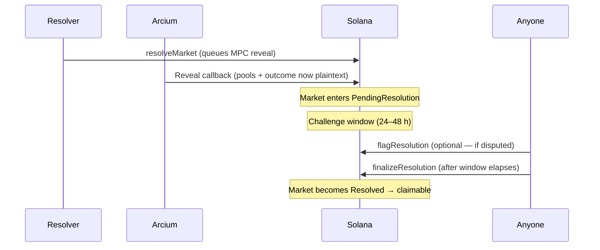

## Market resolution flow

After a market's `closeTime` passes, the designated resolver posts the real-world outcome. Arcium's MPC nodes then decrypt the encrypted bet pool and compute payout ratios. A challenge window follows before the market becomes claimable.



---

## resolveMarket

Posts the real-world outcome and triggers the Arcium MPC reveal circuit. Only the wallet set as `resolver` at market creation can call this.

```typescript
const result = await client.actions.resolveMarket({
  payer: resolverPublicKey,
  resolver: resolverPublicKey,
  marketId: 42n,
  outcomeValue: 1, // 0 = NO/Option0, 1 = YES/Option1, 2+ for multi
  onProgress: ({ stage }) => console.log(stage),
});
```

After this call the market moves to `PendingResolution` (state `4`). The Arcium callback writes revealed pool sizes and the payout ratio. The market does **not** become `Resolved` until `finalizeResolution` is called (or the challenge window elapses undisputed).

### Parameters

<ParamField body="payer" type="PublicKey" required>
  Transaction fee payer.
</ParamField>

<ParamField body="resolver" type="PublicKey" required>
  Must match `market.resolver` on-chain. Any other key throws `UnauthorizedResolver` (error 6005).
</ParamField>

<ParamField body="marketId" type="bigint | number" required>
  Market to resolve. Must be in `awaitingResolve` phase (past `closeTime`, not yet revealed).
</ParamField>

<ParamField body="outcomeValue" type="number" required>
  Winning outcome index. For YesNo: `0` = NO, `1` = YES. For MultiOutcome: `0`-`(numOutcomes - 1)`.
</ParamField>

<ParamField body="computationOffset" type="bigint">
  Arcium computation slot. Random by default.
</ParamField>

<ParamField body="timeoutMs" type="number">
  Milliseconds to wait for the MPC callback. Defaults to `60_000`.
</ParamField>

<ParamField body="onProgress" type="ProgressCallback">
  Progress callback. Stages: `validating → fetching-state → submitting → awaiting-callback → refetching → done`.
</ParamField>

### Return value

<ResponseField name="signature" type="string">
  Transaction signature.
</ResponseField>

<ResponseField name="market" type="MarketAccount | null">
  Market account after the reveal callback ran. Check `market.state` - it will be `4` (PendingResolution) at this point.
</ResponseField>

<ResponseField name="computation" type="ComputationResult">
  Arcium callback result.
</ResponseField>

---

## flagResolution

Flags a pending resolution as disputed during the challenge window. Permissionless - anyone can call this if they believe the outcome is wrong.

```typescript
const flag = await client.actions.flagResolution({
  flagger: walletPublicKey,
  marketId: 42n,
});
```

<ParamField body="flagger" type="PublicKey" required>
  Caller's public key (any wallet).
</ParamField>

<ParamField body="marketId" type="bigint | number" required>
  A market in `PendingResolution` (state `4`) that has not yet been flagged.
</ParamField>

After flagging, the market enters a `disputed` state. Payouts are blocked until an admin calls `adminOverrideResolution`.

---

## finalizeResolution

Finalizes a pending resolution after the challenge window elapses undisputed. Permissionless - anyone can call this to move the market to `Resolved`.

```typescript
const finalize = await client.actions.finalizeResolution({
  caller: walletPublicKey,
  marketId: 42n,
});
```

<ParamField body="caller" type="PublicKey" required>
  Any wallet (permissionless).
</ParamField>

<ParamField body="marketId" type="bigint | number" required>
  A market in `PendingResolution` that is not disputed and whose `challengePeriod` has elapsed.
</ParamField>

After this call the market state becomes `Resolved` and `claim_deadline` is set, opening the payout window.

---

## adminOverrideResolution

Overrides the outcome on a disputed market. Admin-only.

```typescript
const override = await client.actions.adminOverrideResolution({
  admin: adminPublicKey,
  marketId: 42n,
  outcomeValue: 0, // corrected outcome
});
```

<ParamField body="admin" type="PublicKey" required>
  Must match `globalState.admin` on-chain.
</ParamField>

<ParamField body="marketId" type="bigint | number" required>
  A disputed market in `PendingResolution`.
</ParamField>

<ParamField body="outcomeValue" type="number" required>
  Corrected outcome index. The program recomputes `payout_ratio` from the already-revealed plaintext pools using this value.
</ParamField>

After this call the market moves to `Resolved` and the `ResolutionOverriddenEvent` is emitted.

---

## Phase gate reference

| Action | Required phase | Required state |
|---|---|---|
| `resolveMarket` | `awaitingResolve` | Active or Closed, past `closeTime` |
| `flagResolution` | `pendingResolution` | PendingResolution (4), not disputed |
| `finalizeResolution` | `awaitingFinalize` | PendingResolution (4), not disputed, window elapsed |
| `adminOverrideResolution` | `disputed` | PendingResolution (4), disputed |
